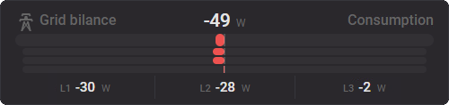

# 3f Gauge Card

[](#instalace-pres-hacs)
[](https://github.com/Jenik5/3fGauge/releases/latest)
[](https://github.com/Jenik5/3fGauge/actions/workflows/validate.yml)
[](https://github.com/Jenik5/3fGauge/releases)
[](LICENSE)

Kompaktní Lovelace karta pro zobrazení jedné třífázové veličiny v Home Assistantu. Zobrazuje celkovou hodnotu (volitelně) a hodnoty fází L1, L2 a L3 jako čísla i horizontální bary.



## Instalace přes HACS

1. V HACS otevřete nabídku **Custom repositories**.
2. Přidejte `https://github.com/Jenik5/3fGauge` jako typ **Dashboard**.
3. Vyhledejte **3f Gauge Card** a zvolte **Download**.

HACS kartu nainstaluje do `/config/www/community/3fGauge/` a obvykle také automaticky zaregistruje její JavaScriptový modul. Pokud se resource nevytvoří automaticky, přidejte v **Nastavení → Nástěnky → Zdroje**:

```text
/hacsfiles/3fGauge/3f-gauge.js
```

## Ruční instalace

Stáhněte `3f-gauge.js` z poslední verze repozitáře do:

```text
/config/www/community/3fGauge/3f-gauge.js
```

V **Nastavení → Nástěnky → Zdroje** potom přidejte JavaScriptový modul:

```text
/local/community/3fGauge/3f-gauge.js
```

## První testovací konfigurace

```yaml
type: custom:three-f-gauge-card
main:
  entity: sensor.active_power
  name: Aktivní výkon
  min: -12000
  max: 12000
phases:
  entities:
    - sensor.active_power_l1
    - sensor.active_power_l2
    - sensor.active_power_l3
  min: -5000
  max: 5000
```

Pokud jsou hodnoty pouze kladné, nastavte `min: 0`. Nula pak bude vlevo. Pokud je `min` záporné a `max` kladné, karta umístí nulu na odpovídající místo uvnitř baru a záporné hodnoty vykreslí doleva.

## Konfigurace

| Klíč | Povinný | Popis |
|---|---:|---|
| `type` | ano | Vždy `custom:three-f-gauge-card`. |
| `main` | ne | Konfigurace hlavní hodnoty. |
| `phases` | ano | Konfigurace přesně tří fází. |
| `description` | ne | Pravá doplňková informace: text, stav entity nebo Home Assistant template. |

### Hlavní hodnota

```yaml
main:
  entity: sensor.active_power
  name: Aktivní výkon
  min: -12000
  max: 12000
  precision: 0
  unit: W
  color: var(--primary-color)
```

`name` se zobrazuje vlevo v horním řádku. Pokud není uvedeno, použije se `friendly_name` hlavní entity.

Pokud celkový senzor neexistuje a součet dává pro danou veličinu smysl, lze jej vypočítat z fází:

```yaml
main:
  calculate: sum
  name: Celkem
  min: 0
  max: 15000
```

`entity` má přednost před `calculate`. Kliknutí na hlavní hodnotu nebo bar otevře dialog senzoru; u vypočteného součtu dialog není k dispozici.

### Fáze

```yaml
phases:
  entities:
    - sensor.phase_1
    - sensor.phase_2
    - sensor.phase_3
  names: [L1, L2, L3]
  min: 0
  max: 5000
  precision: 1
  unit: W
  color: "#03a9f4"
```

`min` a `max` jsou společné pro všechny tři fáze. `names`, `precision`, `unit` a `color` jsou volitelné. Jednotka se standardně převezme z atributu senzoru.

### Barevné intervaly

Pevnou barvu lze nahradit intervaly. Vyhraje první interval, kterému hodnota odpovídá; chybějící `from` nebo `to` znamená otevřený konec.

```yaml
phases:
  entities:
    - sensor.active_power_l1
    - sensor.active_power_l2
    - sensor.active_power_l3
  min: -5000
  max: 5000
  color: var(--primary-color)
  color_ranges:
    - to: -0.01
      color: "#e57373"
    - from: 0
      to: 3500
      color: "#66bb6a"
    - from: 3500.01
      color: "#ffa726"
```

Stejné klíče `color` a `color_ranges` lze použít i v sekci `main`.

### Doplňkový popis

Statický text:

```yaml
description: Odběr ze sítě
```

Stav entity (např. template senzoru vytvořeného v Home Assistantu):

```yaml
description:
  entity: sensor.grid_flow_description
```

Přímo reaktivní Home Assistant Jinja template:

```yaml
description:
  template: >-
    
    {{ "Dodávka" if power > 0 else "Odběr" }}
```

Template se přepočítá automaticky při změně použitých entit. Volitelná data lze předat také mapou `description.variables`.

## Poznámky

- Hodnoty mimo nastavený rozsah jsou v baru oříznuty na minimum nebo maximum; číselná hodnota zůstane skutečná.
- Nedostupný nebo nečíselný senzor se zobrazí jako `Unavailable` a jeho bar je zeslabený.
