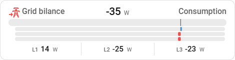
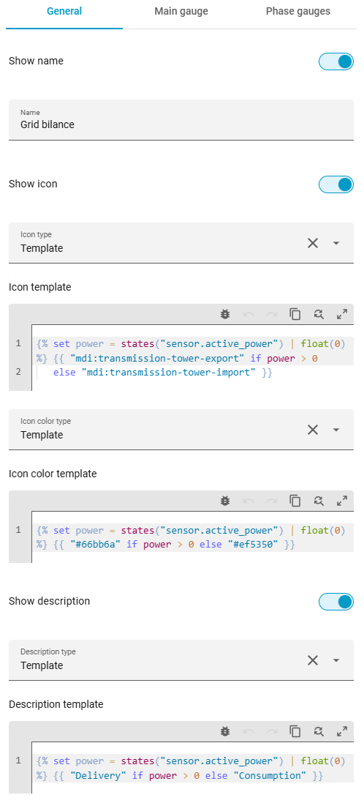
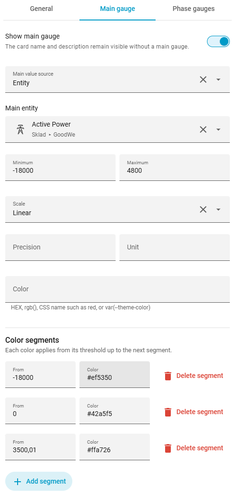
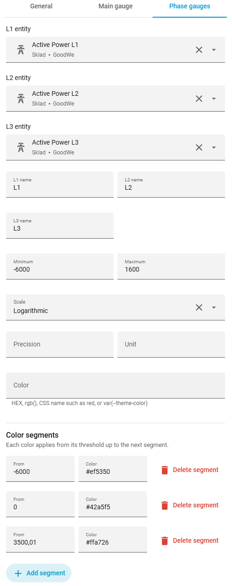

# 3f Gauge Card

[English](../README.md) | **Čeština**

[](#instalace-pres-hacs)
[](https://github.com/Jenik5/3fGauge/releases/latest)
[](https://github.com/Jenik5/3fGauge/actions/workflows/validate.yml)
[](https://github.com/Jenik5/3fGauge/releases)
[](../LICENSE)

Kompaktní Lovelace karta pro zobrazení jedné třífázové veličiny v Home Assistantu. Zobrazuje celkovou hodnotu (volitelně) a hodnoty fází L1, L2 a L3 jako čísla i horizontální bary.

Aktuální verze: `2026.08.18.01`



## Instalace přes HACS

1. V HACS otevřete nabídku **Custom repositories**.
2. Přidejte `https://github.com/Jenik5/3fGauge` jako typ **Dashboard**.
3. Vyhledejte **3f Gauge Card** a zvolte **Download**.

HACS kartu nainstaluje do `/config/www/community/3fGauge/` a obvykle také automaticky zaregistruje její JavaScriptový modul. Pokud se resource nevytvoří automaticky, přidejte v **Nastavení → Nástěnky → Zdroje**:

```text
/hacsfiles/3fGauge/3f-gauge.js
```

## Ruční instalace

Stáhněte `3f-gauge.js` z poslední verze repozitáře do:

```text
/config/www/community/3fGauge/3f-gauge.js
```

V **Nastavení → Nástěnky → Zdroje** potom přidejte JavaScriptový modul:

```text
/local/community/3fGauge/3f-gauge.js
```

## První testovací konfigurace

```yaml
type: custom:three-f-gauge-card
name: Aktivní výkon
main:
  entity: sensor.active_power
  min: -12000
  max: 12000
phases:
  entities:
    - sensor.active_power_l1
    - sensor.active_power_l2
    - sensor.active_power_l3
  min: -5000
  max: 5000
```

Pokud jsou hodnoty pouze kladné, nastavte `min: 0`. Nula pak bude vlevo. Pokud je `min` záporné a `max` kladné, karta umístí nulu na odpovídající místo uvnitř baru a záporné hodnoty vykreslí doleva.

## Konfigurace

| Klíč | Povinný | Popis |
|---|---:|---|
| `type` | ano | Vždy `custom:three-f-gauge-card`. |
| `name` | ne | Název karty. Funguje i bez hlavní gauge. |
| `main` | ne | Konfigurace hlavní hodnoty. |
| `phases` | ano | Konfigurace přesně tří fází. |
| `description` | ne | Pravá doplňková informace: text, stav entity nebo Home Assistant template. |
| `icon` | ne | Ikona karty jako pevná hodnota nebo Home Assistant template. Bez nastavení se použije ikona hlavní entity. |
| `icon_color` | ne | Barva ikony jako pevná CSS barva nebo Home Assistant template. |
| `show_name` | ne | Zobrazení názvu; výchozí hodnota je `true`. |
| `show_icon` | ne | Zobrazení ikony; výchozí hodnota je `true`. |
| `show_description` | ne | Zobrazení popisu; výchozí hodnota je `true`. |

### Vizuální editor

Karta poskytuje vizuální editor se třemi záložkami pro obecné nastavení, hlavní ukazatel a ukazatele fází. V nastavení hlavního ukazatele a fází lze také přidávat a odebírat barevné segmenty.

Editor automaticky používá jazyk uživatelského profilu Home Assistantu. Součástí jsou lokalizace pro angličtinu (`en`), češtinu (`cs`), slovenštinu (`sk`), němčinu (`de`) a polštinu (`pl`). Pro ostatní jazyky se použije angličtina.

<table>
  <tr>
    <th>General</th>
    <th>Main gauge</th>
    <th>Phase gauges</th>
  </tr>
  <tr>
    <td valign="top"></td>
    <td valign="top"></td>
    <td valign="top"></td>
  </tr>
</table>

### Rozložení v Sections view

Karta podporuje editor rozložení Home Assistantu. Minimální šířka je 6 z 12 sloupců. Běžná karta nebo karta s hlavní gauge vyžaduje nejméně 2 řádky.

Pokud není nastavena hlavní gauge a zároveň není zobrazen název, ikona ani popis, lze výšku zmenšit na 1 řádek:

```yaml
show_name: false
show_icon: false
show_description: false
phases:
  # ...
```

Při nastavení větší výšky karta vyplní celý přidělený prostor a přebytečná výška se projeví jako větší spodní prostor. Volby viditelnosti pouze skryjí příslušné části; jejich nastavené hodnoty nemažou.

### Hlavní hodnota

```yaml
name: Aktivní výkon
main:
  entity: sensor.active_power
  min: -12000
  max: 12000
  precision: 0
  unit: W
  color: var(--primary-color)
```

`name` je na nejvyšší úrovni konfigurace a zobrazuje se vlevo v horním řádku. Pokud není uvedeno, použije se `friendly_name` hlavní entity nebo první dostupné fáze. Starší zápis `main.name` karta nadále načte kvůli zpětné kompatibilitě.

Pokud celkový senzor neexistuje a součet dává pro danou veličinu smysl, lze jej vypočítat z fází:

```yaml
name: Celkem
main:
  calculate: sum
  min: 0
  max: 15000
```

`entity` má přednost před `calculate`. Kliknutí na hlavní hodnotu nebo bar otevře dialog senzoru; u vypočteného součtu dialog není k dispozici.

### Ikona

Ikonu entity lze přepsat pevnou ikonou a barvou:

```yaml
icon: mdi:transmission-tower
icon_color: "#42a5f5"
```

Obě hodnoty mohou být reaktivní Home Assistant Jinja template. Díky tomu se ikona i její barva mohou měnit podle směru toku energie:

```yaml
icon:
  template: >-
    
    {{ "mdi:transmission-tower-export" if power > 0 else "mdi:transmission-tower-import" }}
icon_color:
  template: >-
    
    {{ "#66bb6a" if power > 0 else "#ef5350" }}
```

Template se automaticky přepočítá při změně použitých entit. Stejně jako u `description` lze volitelná data předat mapou `variables` uvnitř příslušného objektu.

### Fáze

```yaml
phases:
  entities:
    - sensor.phase_1
    - sensor.phase_2
    - sensor.phase_3
  names: [L1, L2, L3]
  min: 0
  max: 5000
  precision: 1
  unit: W
  color: "#03a9f4"
```

`min` a `max` jsou společné pro všechny tři fáze. `names`, `precision`, `unit`, `color` a `scale` jsou volitelné. Jednotka se standardně převezme z atributu senzoru.

### Stupnice barů

Výchozí stupnice je lineární. Pokud velký rozsah způsobuje, že jsou běžné malé hodnoty téměř neviditelné, lze pro `main` i `phases` samostatně zapnout logaritmickou stupnici:

```yaml
main:
  entity: sensor.active_power
  min: -17000
  max: 4800
  scale: logarithmic
```

Hodnota `scale: logarithmic` zvýrazní změny blízko nuly a postupně stlačí vyšší hodnoty. Nula i oba konce rozsahu zůstávají přesné. Pokud rozsah obsahuje záporné i kladné hodnoty, transformuje se každá strana samostatně a poloha nuly se stále určuje z poměru `min` a `max`. V uvedeném příkladu je proto nula přibližně v 78 % šířky baru, nikoliv uprostřed.

Podporované hodnoty `scale` jsou:

- `linear` – výchozí lineární průběh,
- `logarithmic` – výraznější změny při nízkých hodnotách.

Číselné hodnoty, barevné intervaly a ořezávání mimo rozsah vždy používají skutečnou hodnotu senzoru; logaritmická stupnice ovlivňuje pouze délku baru.

### Barevné intervaly

Pevnou barvu lze doplnit barevnými segmenty. Každý segment začíná hodnotou `from` a platí až do začátku následujícího segmentu. Vyhraje tedy segment s nejvyšší hodnotou `from`, která je menší nebo rovna aktuální hodnotě. Pro hodnoty pod prvním segmentem se použije základní `color`.

```yaml
phases:
  entities:
    - sensor.active_power_l1
    - sensor.active_power_l2
    - sensor.active_power_l3
  min: -5000
  max: 5000
  color: var(--primary-color)
  color_ranges:
    - from: -5000
      color: red
    - from: 0
      color: green
    - from: 3500
      color: orange
```

Barva může být zapsaná jako HEX (`#66bb6a`), `rgb(...)`, standardní CSS název (`red`, `green`, `orange`…) nebo proměnná tématu (`var(--primary-color)`). Stejné klíče `color` a `color_ranges` lze použít i v sekci `main`.

Starší konfigurace s explicitním `to` zůstávají podporované. Vizuální editor je při první změně segmentů převede na prahový zápis pouze s `from`.

### Doplňkový popis

Statický text:

```yaml
description: Odběr ze sítě
```

Stav entity (např. template senzoru vytvořeného v Home Assistantu):

```yaml
description:
  entity: sensor.grid_flow_description
```

Přímo reaktivní Home Assistant Jinja template:

```yaml
description:
  template: >-
    
    {{ "Dodávka" if power > 0 else "Odběr" }}
```

Template se přepočítá automaticky při změně použitých entit. Volitelná data lze předat také mapou `description.variables`.

## Poznámky

- Hodnoty mimo nastavený rozsah jsou v baru oříznuty na minimum nebo maximum; číselná hodnota zůstane skutečná.
- Nedostupný nebo nečíselný senzor se zobrazí jako `Unavailable` a jeho bar je zeslabený.

## Verzování

Verze používají formát `YYYY.MM.DD.NN`, kde poslední dvojčíslí označuje pořadí vydání v daném dni. Například `2026.08.18.01` je první vydání z 18. srpna 2026.
